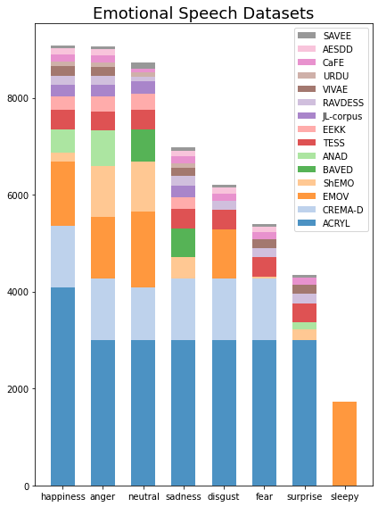
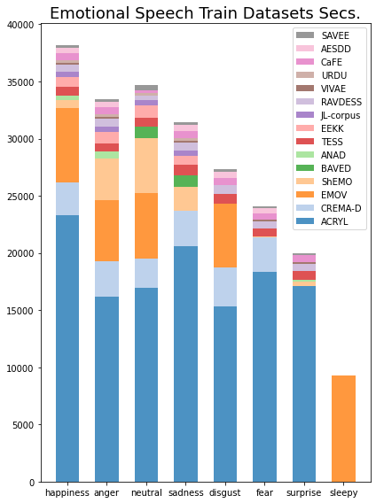
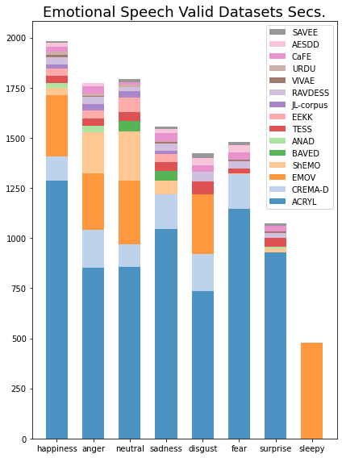

# speech-emotion-recognition

### Dataset Distribution

### Remarks
A RNN style classification with padding is problematic.
A RNN sequentially processes the input, meaning paddings are processed last.
When padding become longer, in my perspective, it would be harder for the network to preserve information or data distribution from non-padding input.
1. It would be meaningful to check whether this assumption, longer padding hurts the accuracy, is valid or not.
2. Self-attention based networks solves this issue by setting lower attention score on padding.
3. Deeper RNN vs Transformer

### Random Seed Issue
Train/Test split should be same for before and after resume training

### References
[SER-datasets](https://github.com/SuperKogito/SER-datasets)
